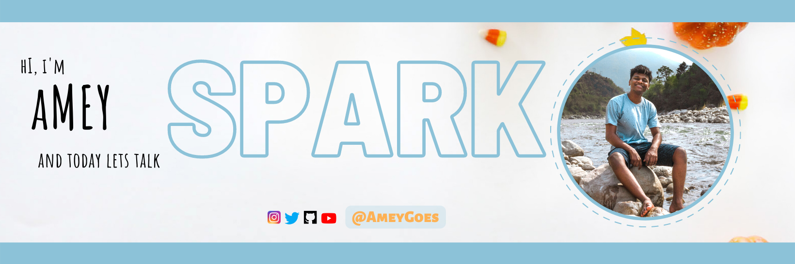

## 🚀 About Me
🔭 I’m currently a Computer Science Graduate Student at Arizona State University.

🌱 Visit my Portfolio

👯 I’m looking for Summer Internship Opportunities to expand my knowledge and network.

👨‍💻 All of my projects are available at my GitHub

📫 How to reach me amey.bhilegaonkar@asu.edu


# Java Spark Projects



This repository contains following Projects

<!-- Project 1 -->
 - Project 1 : It is a simple Java Application, which reads a text csv file and conerts the file into
 ```
 Dataset<Row> object
 ```
    - A Dataset object then gets loaded into PostGreSQL table at the backend.
    - We are also performing trasnformations and actions to understand he difference between the two.
    - How to Datasets are immutable and have to be reassigned once the action has been performed on it was understood.


<!-- Project 2 -->
 - Project 1 : It is a simple Java Application, which reads a text csv file and conerts the file into
 ```
 Dataset<Row> object
 ```
    - A Dataset object then gets loaded into PostGreSQL table at the backend.
    - We are also performing trasnformations and actions to understand he difference between the two.
    - How to Datasets are immutable and have to be reassigned once the action has been performed on it was understood.


<!-- Project 3 -->
 - Project 1 : It is a simple Java Application, which reads a text csv file and conerts the file into
 ```
 Dataset<Row> object
 ```
    - A Dataset object then gets loaded into PostGreSQL table at the backend.
    - We are also performing trasnformations and actions to understand he difference between the two.
    - How to Datasets are immutable and have to be reassigned once the action has been performed on it was understood.

<!-- Project 4 -->
 - Project 1 : It is a simple Java Application, which reads a text csv file and conerts the file into
 ```
 Dataset<Row> object
 ```
    - A Dataset object then gets loaded into PostGreSQL table at the backend.
    - We are also performing trasnformations and actions to understand he difference between the two.
    - How to Datasets are immutable and have to be reassigned once the action has been performed on it was understood.


<!-- Project 5 -->
 - Project 1 : It is a simple Java Application, which reads a text csv file and conerts the file into
 ```
 Dataset<Row> object
 ```
    - A Dataset object then gets loaded into PostGreSQL table at the backend.
    - We are also performing trasnformations and actions to understand he difference between the two.
    - How to Datasets are immutable and have to be reassigned once the action has been performed on it was understood.

<!-- Project 6 -->
 - Project 1 : It is a simple Java Application, which reads a text csv file and conerts the file into
 ```
 Dataset<Row> object
 ```
    - A Dataset object then gets loaded into PostGreSQL table at the backend.
    - We are also performing trasnformations and actions to understand he difference between the two.
    - How to Datasets are immutable and have to be reassigned once the action has been performed on it was understood.


<!-- Project 7 -->
 - Project 1 : It is a simple Java Application, which reads a text csv file and conerts the file into
 ```
 Dataset<Row> object
 ```
    - A Dataset object then gets loaded into PostGreSQL table at the backend.
    - We are also performing trasnformations and actions to understand he difference between the two.
    - How to Datasets are immutable and have to be reassigned once the action has been performed on it was understood.

<!-- Project 8 -->
 - Project 1 : It is a simple Java Application, which reads a text csv file and conerts the file into
 ```
 Dataset<Row> object
 ```
    - A Dataset object then gets loaded into PostGreSQL table at the backend.
    - We are also performing trasnformations and actions to understand he difference between the two.
    - How to Datasets are immutable and have to be reassigned once the action has been performed on it was understood.


<!-- Project 9 -->
 - Project 1 : It is a simple Java Application, which reads a text csv file and conerts the file into
 ```
 Dataset<Row> object
 ```
    - A Dataset object then gets loaded into PostGreSQL table at the backend.
    - We are also performing trasnformations and actions to understand he difference between the two.
    - How to Datasets are immutable and have to be reassigned once the action has been performed on it was understood.

## Environment Variables

To run this project, you will need to set the following Environment Variables

- `POSTGRES_PASS` - Password to your postgress table.


## Run Project


To run this project locally, you need to:
- Import maven project into intellij
- [Install PostgreSQL](https://www.postgresql.org/download/)

## Authors

- [@Amey Bhilegaonkar](https://ameyportfolio.netlify.app/)


## 🛠 Skills

  <p align="left">
    <!-- JAVA -->
  <a href="https://www.java.com" target="_blank">  </a>


  <!-- Amazon CLoud -->
  <a href="https://aws.amazon.com" target="_blank">  </a>
 
  <!-- GIT -->
  <a href="https://git-scm.com/" target="_blank">  </a>
  
  <!-- Cassandra -->
  <a href="https://cassandra.apache.org/" target="_blank">  </a>
  
  <!-- MySQL -->
  <a href="https://www.mysql.com/" target="_blank">  </a>
 
<hr>
  <!--  Connect With me -->
  <h3 align="left">My Socials:</h3>
  <p align="left">
  <!--  LinkedIn  -->
  <a href="https://linkedin.com/in/amey-bhilegaonkar/" target="blank"></a>
  <!--  Instagram  -->
  <a href="https://instagram.com/ameygoes" target="blank"></a>
  <!--YouTube    -->
  <a href="https://www.youtube.com/c/ameygoes" target="blank"></a>
  <!--  Medium  -->
  <a href="https://medium.com/@ameygoes" target="blank"></a>
  <!--  PodCasts  -->
  <a href="/https://anchor.fm/s/5932883c/podcast/rss" target="blank"></a>
  </p>


  <hr>
  <h3 align="left">Support Me:</h3>
  <p><a href="https://www.buymeacoffee.com/ameygoes"> </a></p>
  <br>
  <br>
  
  

## Support

For support, email 

    abhilega@asu.edu

- with the Subject: JAVA_SPARK_QUERY, 
- with the Body: 
    - Name:
    - Query:

